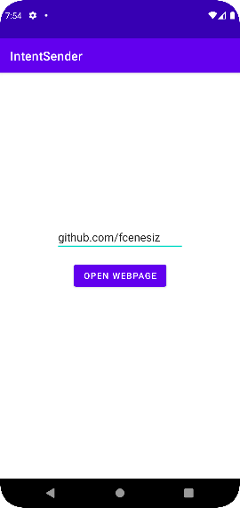
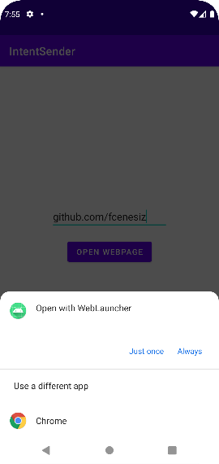
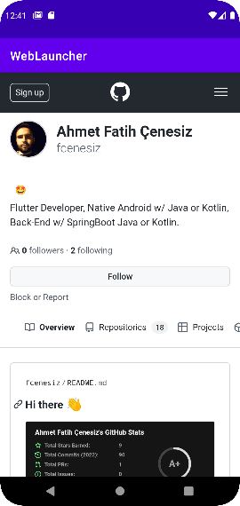

## Implicit Intent Usage
Redirect the app to open a webpage
```Java
Intent intent = new Intent(Intent.ACTION_VIEW,
                    Uri.parse("https://github.com/fcenesiz"));
startActivity(intent);
```

 
 
 